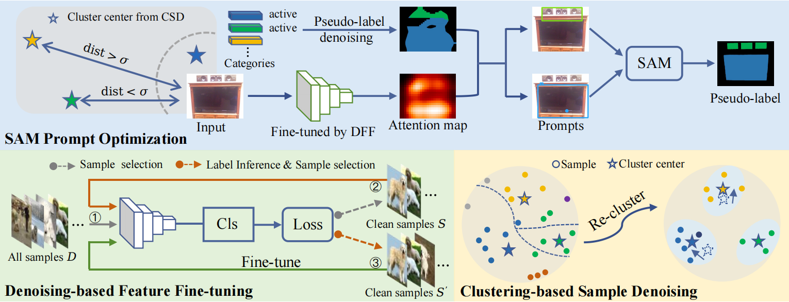
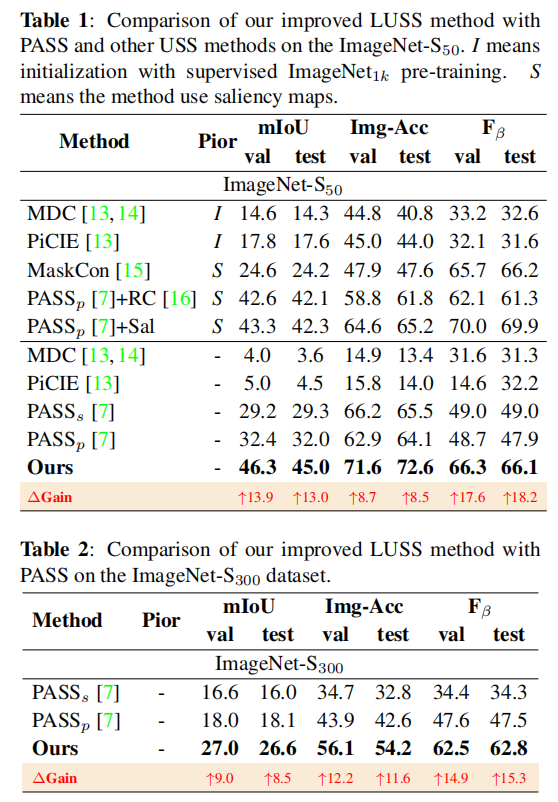

# Pseudo-label Denoising and SAM Optimization for Large-scale Unsupervised Semantic Segmentation
# Network Architecture
The architecture of our proposed approach is as follows



We first propose a denoising-based feature fine-tuning (DFF) module to fine-tune the unsupervised pre-trained backbone with potential clean samples for more robust category-related representations.  Then, a clustering-based sample denoising (CSD) module is proposed to obtain the denoised large-scale data for more representative centers to improve the reliability of the pixel-level label assignment. Moreover, we propose a SAM prompt optimization (SPO) module to exploit the SAM mask with both point and bounding box prompts for the active categories to further refine the object boundaries in pseudo-labels.


<div id="1"></div>

# Installation
* System: **Linux**(e.g. Ubuntu/CentOS/Arch), **macOS**, or **Windows Subsystem of Linux (WSL)**
* Python version == 3.6
* CPU compiler (require at least one of the following)
    * g++ (>=5.4.0)
    * clang (>=8.0)

```shell
python -m pip install tqdm
python -m pip install pillow
python -m pip install opencv-python
python -m pip install pydensecrf
python -m pip install scikit-image
python -m pip install multiprocess
```

* System: **Linux**(e.g. Ubuntu/CentOS/Arch), **macOS**, or **Windows Subsystem of Linux (WSL)**
* Python version >= 3.7
* CPU compiler (require at least one of the following)
    * g++ (>=5.4.0)
    * clang (>=8.0)


[Jittor install](https://github.com/Jittor/jittor#install)

```shell
python -m pip install scikit-learn
python -m pip install pandas
python -m pip install munkres
python -m pip install tqdm
python -m pip install pillow
python -m pip install opencv-python
python -m pip install faiss-gpu
python -m pip install scipy
python -m pip install matplotlib
pip3 install torch torchvision torchaudio
```
# Train
We give the training details in [train.sh](./train.sh).
# Results on the ImageNet-S50 and ImageNet-S300 datasets

